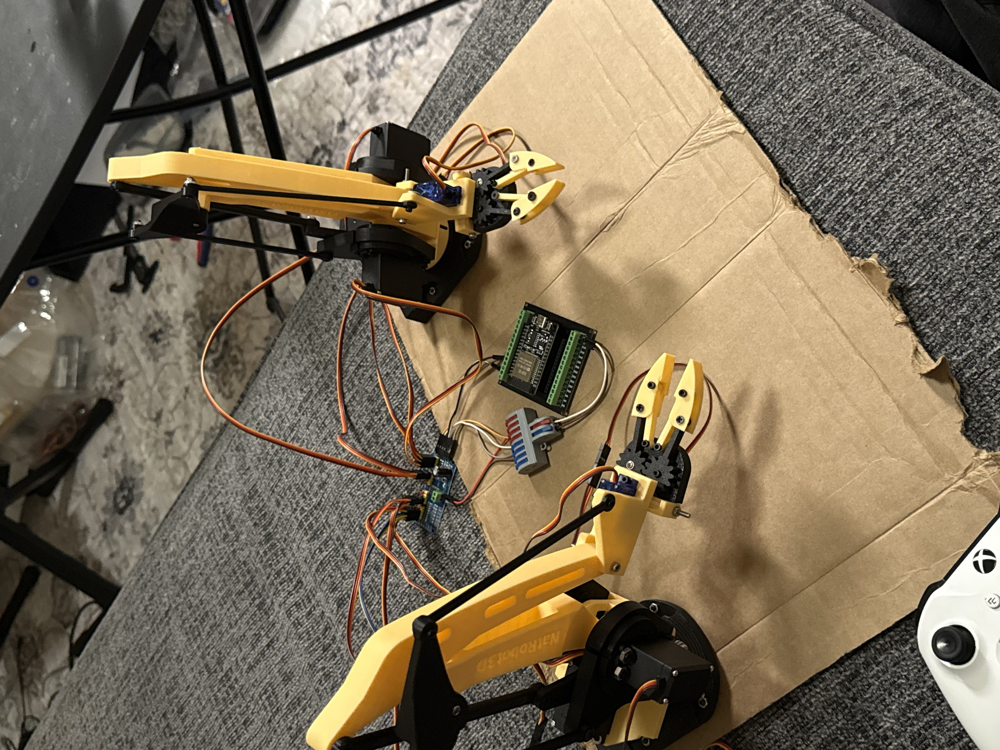
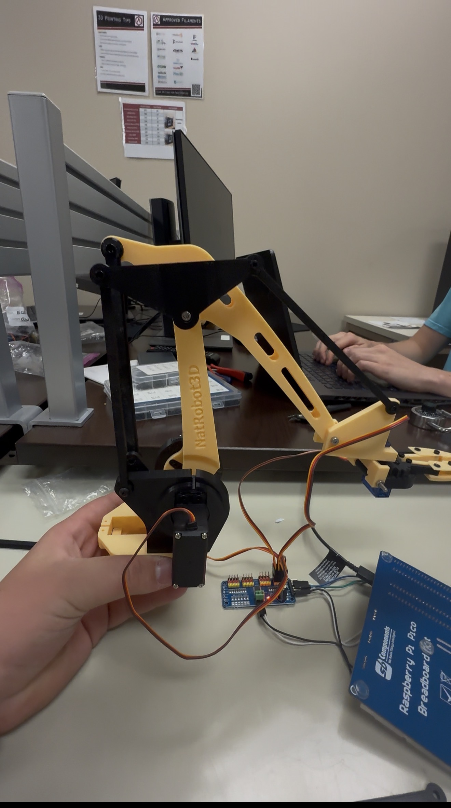

# Dual Robotic Arms With ESP32 Bluetooth Control

Status: Prototype robotics project

This project is a dual robotic arm system controlled by an Xbox controller through an ESP32, Bluepad32, and PCA9685 PWM servo drivers. It demonstrates embedded control, servo calibration, Bluetooth input mapping, mechanical assembly, and practical debugging of a high-servo-count system.

## Overview

The project explored coordinated control of two 3D-printed robotic arms using a game controller. The system maps controller inputs to multiple servo axes so the arms can rotate, extend, grip, and move through calibrated ranges.

## System Architecture

- Controller: ESP32
- Input: Xbox controller over Bluetooth
- Bluetooth library: Bluepad32
- Servo driver: PCA9685 PWM driver boards
- Actuators: MG995 and MS90 servos
- Mechanical system: 3D-printed NatV2 robotic arm parts with 6203 bearings
- Firmware: Arduino/C++

## Controls And Firmware

The firmware was written in C++ using the Arduino IDE. Bluepad32 handles controller pairing and input. The Adafruit PWM servo driver library sends servo commands through the PCA9685 boards.

The control logic includes servo min/max calibration, serial debugging, and controller mappings for claws, rotation, extension, and axis selection.

Documented control behavior includes:

- trigger inputs open and close the left and right claws
- joystick axes control arm rotation, extension, and claw rotation depending on mode
- A/B/X/Y buttons switch which arm axes are active

## Mechanical Build

The team compared arm designs, selected a larger dual-arm configuration, printed the parts at the makerspace, and assembled the arms with bearings, fasteners, servos, and wire extensions.

## Testing Status

Both arms responded to Bluetooth controller input and demonstrated gripping, lifting, and multi-joint movement. During testing, servo ranges and controller behavior were adjusted to reduce binding and make motion more predictable.

More complete documentation should eventually add the firmware source, full pin/channel map, servo limits, power wiring, measured current draw, and a demo video.

## What This Demonstrates

- ESP32 Bluetooth control
- Bluepad32 controller integration
- PCA9685 PWM servo driving
- Multi-servo calibration and motion mapping
- 3D-printed robotics assembly
- Practical mechanical/electrical debugging

## Future Improvements

- Add firmware source and channel mapping.
- Add power architecture and servo rail notes.
- Add measured current draw under load.
- Add photos of the controller/electronics wiring.
- Add demo media showing movement and controller mapping.

## Portfolio

Portfolio page: [Dual Robotic Arms](https://wchowellarchive.web.app/Projects/RobotArmsProject/RobotArmsProject.html)
